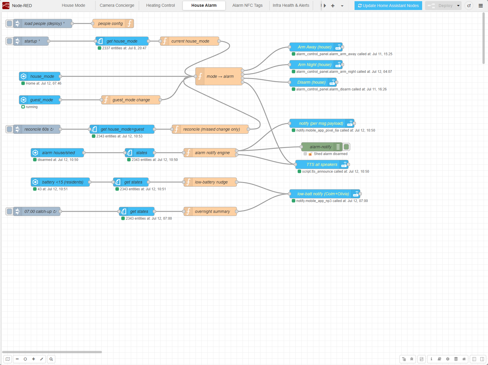
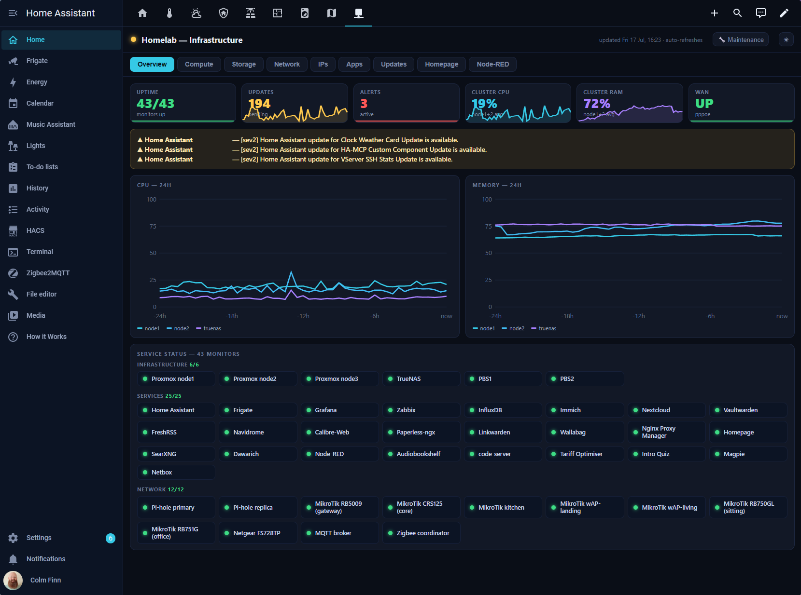
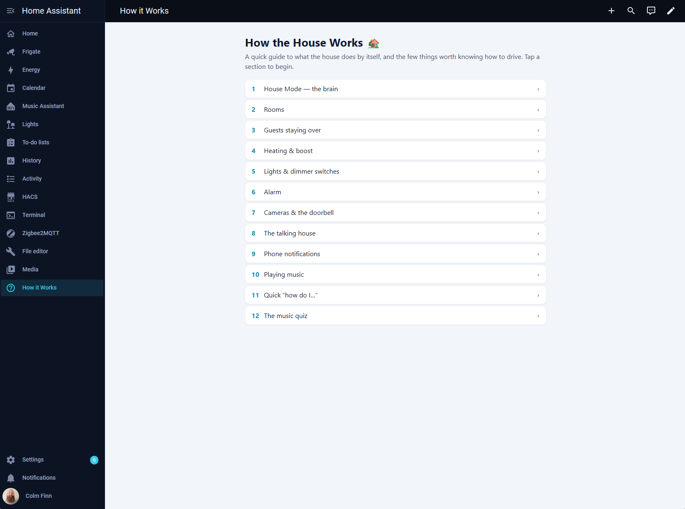
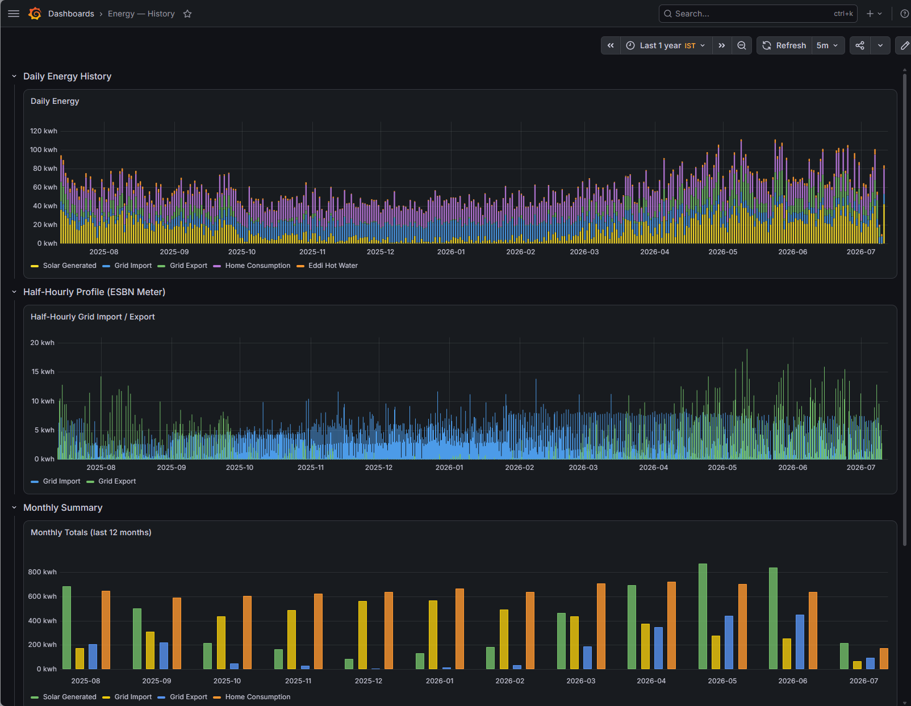
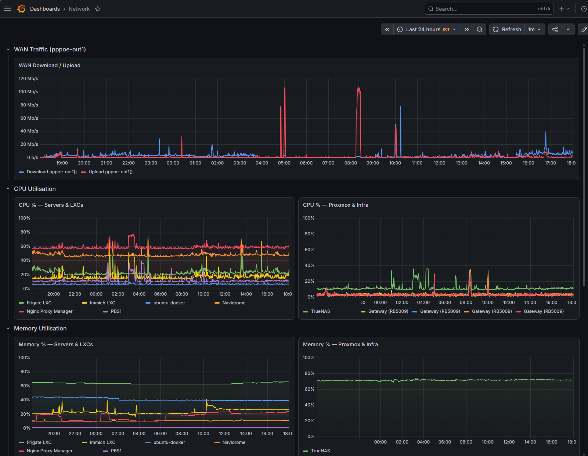

# 🏠 Colm's Home Assistant Config

*A family smart home in Ireland — built for reliability, not demos.*

---

This repository is the live, version-controlled configuration that runs the house — every automation, dashboard, integration and helper, committed to git and backed up nightly. The whole setup is deliberately **local-first**: lighting, alarm, cameras, voice and heating keep working without the cloud, the more involved logic lives in Node-RED, and long-term history is kept in InfluxDB well past Home Assistant's recorder window. It's public so anyone can borrow the ideas or patterns for their own setup.

---

## 🏗️ Infrastructure

| Component | Detail |
|---|---|
| **PVE** | Proxmox VE — 2× Beelink S12 Mini PC (Intel N100, 16GB DDR4, 500GB SSD) |
| **HA** | Home Assistant OS — Proxmox VM |
| **NAS** | TrueNAS SCALE — N100 Mini PC (32GB DDR4, 500GB SSD), MainPool (2× mirror, 4× 8TB, ~10.88 TiB usable) |
| **Network** | MikroTik router + 6× managed switches/APs; wireless managed via MikroTik CAPsMAN |
| **VLANs** | Home · IoT · Work · Guest · Mgmt · Stack |
| **DNS** | Pi-hole × 2 (Proxmox LXC primary + TrueNAS app replica) |
| **Cameras** | Frigate NVR — Proxmox LXC, recordings on USB 3.0 RAID 0 enclosure |
| **Monitoring** | Zabbix — TrueNAS hosted; InfluxDB + Grafana — TrueNAS apps |
| **Prox3 (Daire)** | Intel NUC (i3-7100U, 4GB RAM, 256GB SSD) running encrypted Proxmox — connected via WireGuard |

---

## 🔌 Integrations

### Core
| Integration | Purpose |
|---|---|
| [Alarmo](https://github.com/nielsfaber/alarmo) | Multi-zone alarm with Zigbee sensors |
| [Zigbee2MQTT](https://www.zigbee2mqtt.io/) | Zigbee device bridge — all household lights, dimmer switches, motion & contact sensors |
| [Music Assistant](https://music-assistant.io/) | Multi-room audio — TuneIn (radio), Subsonic/Navidrome (local music), gPodder (podcasts) |
| [Frigate](https://frigate.video/) | Local AI camera NVR — person/cat/fox/vehicle detection |
| [go2rtc](https://github.com/AlexxIT/go2rtc) | Low-latency camera stream server (built into Frigate) |
| [Reolink](https://reolink.com/) | Doorbell camera — doorbell press events only; recording and detections handled by Frigate |
| [Immich](https://immich.app/) | Self-hosted photo library — Proxmox LXC, data in TrueNAS dataset |
| [LLM Vision](https://github.com/valentinfrlch/ha-llmvision) | AI camera analysis via Google Gemini |

### Network & Infrastructure
| Integration | Purpose |
|---|---|
| [MikroTik Router](https://github.com/tomaae/homeassistant-mikrotik_router) | Router stats, interface monitoring |
| [Proxmox VE](https://github.com/doudz/homeassistant-proxmoxve) | VM/LXC status monitoring |
| [TrueNAS](https://github.com/tomaae/homeassistant-truenas) | Pool health, disk temps, dataset usage |
| [Pi-hole](https://pi-hole.net) | DNS query stats for two instances |
| [MQTT](https://mqtt.org) | Message broker — Proxmox LXC, underpins Z2M, Frigate and Alarmo |
| [Nextcloud](https://nextcloud.com/) | Self-hosted cloud — Proxmox VM, data in TrueNAS dataset |
| [Collabora Online](https://www.collaboraoffice.com/) | Self-hosted office suite — Ubuntu Docker, WOPI integration with Nextcloud for in-browser document editing |
| [InfluxDB](https://www.influxdata.com/) | Long-term time-series store — TrueNAS app; see the Long-term Data section below |
| [Node-RED](https://nodered.org/) | Flow-based automation — Proxmox LXC; see the Node-RED Workflows section below |

### Energy & Environment
| Integration | Purpose |
|---|---|
| [Autarco](https://www.autarco.com/) | Solar inverter — vendor in liquidation and the cloud integration is offline; migrating to local Modbus via [SolaX Modbus](https://github.com/wills106/homeassistant-solax-modbus) (RS485 adapter on order) |
| [myenergi](https://myenergi.com/) | Solar production, Eddi diverter — preferred for live stats (faster updates) |
| [Netatmo](https://www.netatmo.com/) Smart Thermostat | Controlled locally over HomeKit; heating logic runs in Node-RED (see below) |
| [Met Éireann](https://www.met.ie/) | Weather warnings — custom REST sensor polling the Met Éireann open data API; automation fires immediately on new alerts |
| [Forecast.Solar](https://forecast.solar/) | Solar production forecast |
| [Electricity Maps](https://www.electricitymaps.com/) | Grid CO2 intensity |
| [esbn-to-mqtt](https://github.com/omgapuppy/esbn-to-mqtt) | HA add-on — ESB Networks smart meter data via HDF - feeds Solar dashboard and InfluxDB |

### Media & Lifestyle
| Integration | Purpose |
|---|---|
| NVIDIA Shield TV | Living room media player — IoT VLAN |
| Google Cast | Kitchen display, Google Home & Chromecast Audio devices — whole-home audio — IoT VLAN |
| Samsung TV | 65" sitting room TV — IoT VLAN |
| Android TV | Aoife MiBox S + Cian MiTV + Kitchen MiBox — IoT VLAN |
| Logitech Harmony | 2 hubs — IoT VLAN |
| [Navidrome](https://navidrome.org/) | Self-hosted music streaming — Proxmox LXC, data in TrueNAS dataset |
| [Calibre-Web](https://github.com/janeczku/calibre-web) | Self-hosted ebook library — Proxmox LXC, data in TrueNAS dataset |
| [Paperless-ngx](https://docs.paperless-ngx.com/) | Document management — Ubuntu Docker, data in TrueNAS dataset |
| [Wallabag](https://wallabag.org/) | Read-it-later — Ubuntu Docker, data in TrueNAS dataset |
| [Stremio](https://www.stremio.com/) | Streaming media |
| [Dawarich](https://dawarich.app/) | Location & travel tracking — TrueNAS app, fed from HA Companion App on Android |
| [Waste Collection Schedule](https://github.com/mampfes/hacs_waste_collection_schedule) | Panda Waste bin collection — calendar alerts for upcoming collections |
| [CalDAV](https://www.home-assistant.io/integrations/caldav/) | Calendar integration |
| [HA Companion App](https://companion.home-assistant.io/) | Mobile app on all phones — presence, notifications, location |

---

## 🤖 Automations

51 automations across the home. Key highlights:

### 💡 Lighting
- **All lights on Zigbee2MQTT** — every room migrated off the Hue bridge to Zigbee2MQTT, with HA-native scenes per room (bright/dimmed and colour moods)
- **Dimmer switches** — per-room Hue dimmers (paired to Zigbee2MQTT) toggle and step brightness for each room
- **Occupancy lighting** — hallway, landing, and rooms via Zigbee motion sensors + lux thresholds; scene-based (bright/dimmed), fade-to-off on exit
- **Sunrise/sunset** — scene transitions throughout the day
- **Sitting room power off** — turns off all Harmony devices after 30 minutes of no presence

### 🔒 Security
- **Alarm** — Alarmo multi-zone (house + shed); strobe all lights on trigger (saves/restores state). Arming, disarming, NFC tags and notifications run in Node-RED (see below).
- **Cat alarm** — protects Cian's cockatiel when cage is outside; NFC-toggled, Frigate cat detection → TTS alert; enabling it turns the kitchen TV lightstrip green (restored when disabled)
- **Morning security report** — summary of overnight person detections delivered at 07:00; also notes any cats, foxes, dogs or birds spotted overnight
- **Patio door** — NFC-toggled gate suppresses Frigate rear door & shed alerts when patio door is open; auto-disarms on door close

### 🌤️ Weather
- **Morning forecast** — daily weather summary pushed to all phones at 08:30 with emoji-coded conditions; if Colm or Olivia is more than 100km from home a second block is added for their away location
- **Evening forecast** — tomorrow's forecast pushed at 21:00 each night with the same away-location logic
- **Frost warning** — each weekday morning at 07:30, if the outdoor temperature is at or below freezing a push goes to Colm and Olivia to allow extra time to scrape the car windscreen
- **Fog warning** — each weekday morning at 07:30, if either weather source reports fog a push goes to Colm and Olivia to allow extra time on the commute

### 📦 Alerts
- **Parcel delivery** — Smart Parcel Box sensor triggers a mobile notification + TTS announcement on delivery
- **Low battery** — monitors all Zigbee devices, notifies when battery low
- **Weather warning** — Met Éireann official warnings → immediate mobile alert
- **Bins out** — the night before a Panda Waste collection: a **19:00** reminder of which bin types are due, then at **22:00** a check of Frigate's `waste_bin` object on the Front Van camera — if no bin is detected at the kerb, it announces a **TTS** reminder on the speakers and sends a **second phone alert** with a camera snapshot
- **Appliance notifications** — washing machine, dishwasher and tumble dryer; notifies on cycle start and finish with energy cost; TTS announcement on completion; 22:00–07:00 quiet window
- **Printer auto power cycle** — checks every 15 minutes (07:00–21:00) and power-cycles the Brother printer socket if it goes offline

### 🎉 Fun
- **Hello Olivia** — Frigate face-recognises Olivia at the doorbell on weekdays 1–2pm → LLM Vision (Gemini) writes a short, witty compliment about how she looks that day from the doorbell snapshot, spoken on the kitchen + sitting-room speakers after a short delay (volume boosted then restored, falls back to a generic greeting if vision fails)
- **Colm's Grand Return** — Frigate face recognition detects Colm at the doorbell after 3+ days away; plays a trumpet fanfare and announces his return on all speakers

### 🎵 Audio
- **TTS** — queued announcements with volume save/restore (`script.tts_announce`)
- **Today FM** — one-tap play on kitchen display via Music Assistant

### 🌡️ Climate
- **Heating** — the house heating runs in Node-RED, driven by House Mode and the time of day (see the **Heating Control** flow below). The Netatmo thermostat is controlled locally over HomeKit and holds a flat baseline; Node-RED sets the comfort, evening, overnight and away temperatures on top.

### ⚡ Energy
- **Top days** — solar production and grid export top 5 best days tracked independently; both leaderboards update automatically each evening at 23:59 using myenergi sensors
- **Morning energy stats** — daily solar and energy summary pushed each morning
- **Grid-free day** — notifies both phones at 20:00 if no grid electricity was imported after 8am; includes export total and estimated earnings
- **Peak-rate nudge** — if the washing machine, dishwasher or tumble dryer starts a cycle during the 17:00–19:00 peak electricity window, both phones get a push suggesting the run could wait until after 19:00 (notification only, no announcement)

### 🏠 Infrastructure Monitoring
- **Infrastructure health & backup alerts** — migrated to Node-RED for more complex workflows; see the **Infra Health & Alerts** flow below.
- **Zigbee2MQTT watchdog** — auto-restart with 2 attempts, notifies on outcome
- **Update Tuesday** — generates the monthly homelab update report on the Monday before the 2nd Tuesday; notifies Colm with a link at 19:00

---

## 🔴 Node-RED Workflows

Complex, multi-input automation runs in **Node-RED** (Proxmox LXC). The full flows and config are open source at [colfin22/node-red-config](https://github.com/colfin22/node-red-config).

- **House Mode** — the single source of truth other flows react to: `input_select.house_mode` (Home / Away / Sleeping) plus overlays for storm (auto from Met Éireann) and maintenance (blocks Away, silences infra alerting, auto-expires 4 h). **Away** = both adults out with no indoor motion remaining, so it never trips with someone still inside (Cian has no phone — the motion sensors cover him). **Sleeping** = 22:00–07:00, TVs and sitting-room lights off and 20 minutes without motion, at least one adult home. **Home** resumes on the first morning activity.
- **House Alarm** — follows house mode: **Away** arms away, **Sleeping** arms night, **Home** disarms. Guest mode suspends away-arming only (guests indoors would trip it) — night arming still happens, and switching guest mode off re-arms to match immediately. A welcome-home announcement plays on return from Away. Every alarm event across house and shed — armed, disarmed, triggered, cleared, failed-to-arm — is pushed to both phones and announced on the speakers, however it was changed (phone, NFC or automatic).
- **Alarm NFC Tags** — the front-door tag disarms the house; the back-door tag stands the shed down for up to two hours, re-arming 15 minutes after the door closes (left open at the cap → stays disarmed and sends a push + spoken reminder). At 10pm the shed auto-arms if still disarmed with the door closed.
- **Heating Control** — sets the local HomeKit thermostat from `input_select.house_mode` + time of day (the Netatmo holds a flat baseline; Node-RED only ever raises above it). **Home** → comfort, warmest 7–10pm. **Sleeping** → cooler overnight, warming from 7am — pulled earlier on cold mornings by a nightly Met Éireann forecast check (below-freezing forecasts also push a heads-up the night before). **Away** → baseline, dropping further after a full day empty (a toggle disables the deep setback for absences with pets or plants) — but pre-heats toward comfort when someone is driving home (within ~10 km and getting closer; latches once triggered so a GPS wobble can't bounce the setpoint). Boosting — from the dashboard controls or by nudging the thermostat above the schedule — holds that temperature for two hours; turning it down just cancels. Guest mode keeps the Away setback off while visitors stay. The target is re-asserted every 30 minutes and survives reboots.
- **Camera Concierge** — all Frigate alerting: grouped 3-stage pushes (instant text → snapshot → GIF) to both phones, per zone (Front / Doorbell / Rear) and object type; tapping opens the event clip. Doorbell persons also cast to the kitchen display and Shield TV; couriers and the postman get spoken announcements (silenced while Sleeping — pushes unaffected); rear cameras mute while the patio-door switch is on. While Sleeping, a person at the cars strobes the lights and warns over the speakers; while Away, pushes escalate to a high-priority ⚠️ “Cameras Away” channel. (Replaced seven former HA notify/alert automations.)
- **Infra Watchdog** — escalating alerts off Uptime Kuma (service reachability), quiet-hours aware; TTS only when Colm is home. Silenced while maintenance mode is on — still logged, and anything still down when maintenance ends re-alerts on its next reminder cycle.
- **Infra Health & Alerts** — all homelab health and backup alerting in one flow: server/NAS/app health (CPU, memory, disk, pool, temperature, offline, updates), a daily 07:30 audit that every Proxmox backup ran, config-backup and Restic failure alerts, and Zabbix relays. Notifications go to Colm tagged Health / Backup / Monitoring, with a 22:00–07:00 quiet window flushed at 07:00; silenced (logged only) while maintenance mode is on.

*One of the Node-RED tabs — the House Alarm flow: house-mode-driven arming and disarming, guest-mode handling, NFC overrides, low-battery nudges and spoken event announcements across house and shed.*

---

## 📊 Dashboards

| Tab | Contents |
|---|---|
| **Home** | Room summary, security status, motion, presence |
| **Climate** | Heating, Netatmo thermostat, temperature sensors |
| **Weather** | Met Éireann warnings, forecast, outdoor conditions |
| **Security** | Alarm panel, camera feeds, activity logbook |
| **Solar** | Solar production, import/export, Eddi diverter, top 5 solar days & top 5 export days, ESB Networks official meter (esbn-to-mqtt) |
| **Floorplan** | SVG-based downstairs + upstairs with live entity overlays |
| **Appliances** | Washing machine, dishwasher and other appliance monitoring |
| **Map** | Device tracker map — household presence |
| **Network** | Self-hosted, tabbed homelab **infrastructure** dashboard, embedded as a live status page: hosts, storage, network and app health at a glance, with 24-hour trend graphs, radial gauges, a status matrix and per-service response times, drawn from Uptime Kuma, InfluxDB, Zabbix and Home Assistant |

A separate **"How it Works"** sidebar dashboard (visible to all users) holds a full, plain-language household guide &mdash; house modes, guests, heating, lights, alarm, cameras, announcements and playing music &mdash; served from `www/how-the-house-works.html`. It's the family reference: kept up to date as the setup evolves, so whenever a setting is adjusted or a new feature is added, everyone can simply be pointed to the guide to see how it works.

---

## 📈 Long-term Data (InfluxDB + Grafana)

HA's recorder purges after 7 days. InfluxDB (TrueNAS app) stores everything long-term; Grafana (TrueNAS app) provides dashboards on top of it with Zabbix as a second data source.

### What's stored

| Measurement | Source | Range | Fields |
|---|---|---|---|
| `myenergi_daily` | myenergi Eddi CSV exports | 11-06-2025 → present | Solar generated, grid import, grid export, green energy, Eddi divert |
| `autarco_daily` | Autarco inverter | 11-06-2025 → present | Solar production, export, import, consumption |
| `esbn_daily` | ESB Networks HDF (official meter) | 28-05-2024 → present | Import, export (3–4 day lag; recent days gap-filled from Autarco) |
| `esbn_halfhourly` | ESB Networks HDF | 28-05-2024 → ~3 days ago | Half-hourly import/export profile |
| All HA entities | HA InfluxDB integration | 28-05-2026 → present | Every entity state written continuously — preserves history beyond recorder purge |

### Grafana dashboards

**Energy — Current** — Live solar and import/export running totals; latest complete day summary stats.

**Energy — History** — Daily energy timeseries, half-hourly profile, monthly summary, top days leaderboard.

**Network** — Infrastructure services, network metrics, Zabbix-sourced host stats.

*Energy — History: daily energy (solar, grid import/export, home consumption, Eddi hot water), the half-hourly ESB-meter grid import/export profile, and monthly totals across the last year.*

*Network: WAN download/upload throughput plus CPU and memory utilisation across servers, LXCs and Proxmox nodes over 24 hours.*

---

## 👨‍👩‍👦 Household

| Person | Phone | Notification priority |
|---|---|---|
| Colm | `notify.mobile_app_np3` | All alerts |
| Olivia | `notify.mobile_app_pixel_6a` | Security + presence |
| Cian | `notify.mobile_app_pixel_7a` | Selected |
| Daire (visitor) | `notify.mobile_app_pixel_9a` | Only when at the house |

All alert automations respect a **22:00–07:00 quiet window** — overnight events are held and delivered with the original trigger time in the title.

---

## 💾 Backup Strategy

| System | Method | Repo |
|---|---|---|
| Home Assistant | Git — selective `.storage` files | `colfin22/ha-config` (this repo) |
| Home Assistant VM | Proxmox hourly + daily snapshots — 24h/7d retention | — |
| MikroTik | Proxmox cron → API export nightly at 02:00 | `colfin22/mikrotik-config` |
| TrueNAS Config | Proxmox cron → API `config/save` weekly Sunday 02:00 | `colfin22/truenas-config` |
| Frigate | Git — `config.yml` | `colfin22/frigate-config` |
| Immich | Git — `docker-compose.yml` | `colfin22/immich-config` |
| Ubuntu Docker | Git — all `docker-compose.yml` and env files, systemd timer daily 02:00 | `colfin22/ubuntu-docker-config` |
| InfluxDB + Grafana | Git — dashboards + provisioning config | `colfin22/influxdb-grafana-config` |
| Node-RED | Git — flows, settings, palette + docker-compose; systemd timer daily 02:30 | [`colfin22/node-red-config`](https://github.com/colfin22/node-red-config) |
| Proxmox VMs & LXCs | Proxmox Backup Server (PBS) — nightly snapshot sync to remote PBS at Prox3 (Daire) | — |
| TrueNAS Datasets | restic — 6 datasets (photos, nextcloud, paperless, influxdb, zabbix, claude-memory) → Prox3 (Daire) daily via sftp; failure alerts via Node-RED | — |
| Claude Memory | rsync every 6h → TrueNAS encrypted dataset (AES-256-GCM) → Prox3 (Daire) daily | — |

This repo (`ha-config`) is **public**. All other config repos (MikroTik, TrueNAS, Frigate, Immich, InfluxDB+Grafana, Ubuntu Docker, Node-RED) are **private**. HA backup includes: dashboards, helpers, Alarmo, zones, persons, tags, energy config, areas.

---

## 🧩 Custom Components (via HACS)

- [alarmo](https://github.com/nielsfaber/alarmo) — alarm management
- [area_occupancy](https://github.com/constructiverobotics/ha-area-occupancy) — area occupancy detection
- [browser_mod](https://github.com/thomasloven/hass-browser_mod) — browser control
- [frigate](https://github.com/blakeblackshear/frigate-hass-integration) — camera NVR
- [immich](https://github.com/outadoc/immich-home-assistant) — photo library
- [LLM Vision](https://github.com/valentinfrlch/ha-llmvision) — AI camera analysis
- [mikrotik_router](https://github.com/tomaae/homeassistant-mikrotik_router) — network monitoring
- [Music Assistant](https://music-assistant.io/) — multi-room audio engine (integration + Jukebox addon)
- [myenergi](https://github.com/CJNE/ha-myenergi) — solar diverter (Eddi)
- [proxmoxve](https://github.com/doudz/homeassistant-proxmoxve) — hypervisor monitoring
- [truenas](https://github.com/tomaae/homeassistant-truenas) — NAS monitoring
- [waste_collection_schedule](https://github.com/mampfes/hacs_waste_collection_schedule) — bin collection
- [vserver_ssh_stats](https://github.com/404GamerNotFound/vserver-ssh-stats) — SSH-based stats collection from VPS/remote servers
- [webrtc](https://github.com/AlexxIT/WebRTC) — low-latency camera streams

---

Running on Proxmox · TrueNAS SCALE · MikroTik · Ireland 🇮🇪 
Built by Colm, with Claude as a hands-on assistant for code, config, and debugging.
 <a href="LICENSE">MIT licence</a> — copy whatever is useful.

